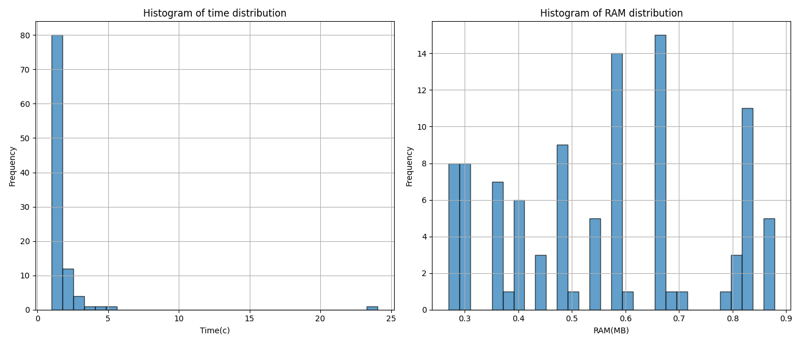
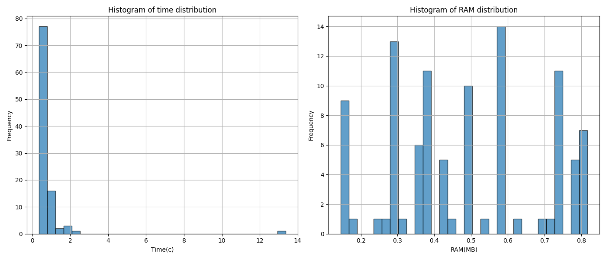
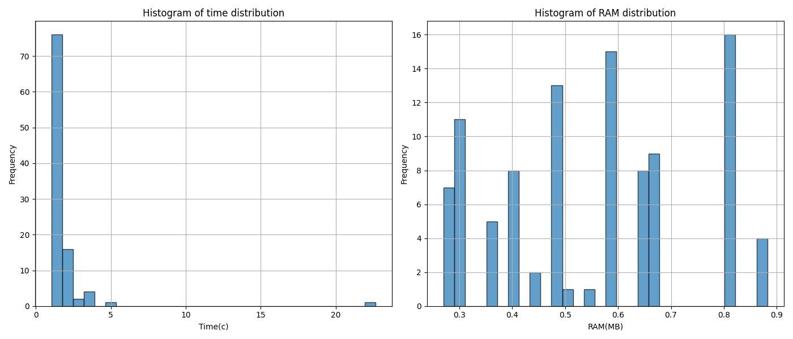
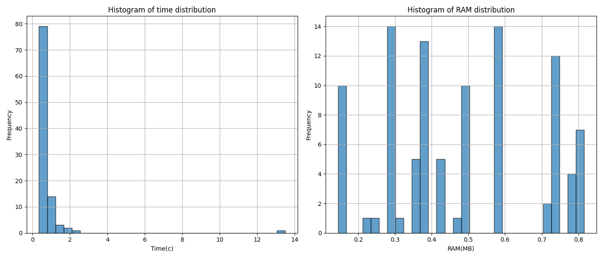

# Users-Age-Predictor

Проект представляет собой систему обработки и хранения данных с использованием Hadoop и Spark. Основная цель проекта — предоставить распределённое, масштабируемое, надёжное и эффективное решение для обработки и хранения данных.

## Датасет
Финальный датасет был создан на основе данных, предоставленных <a href="https://www.kaggle.com/datasets/nfedorov/mts-ml-cookies/data?select=dataset_full.feather"> MTS </a>, с основной целью предсказания возраста пользователей. Итоговый датасет содержит только часть оригинального набора данных и был предварительно обработан для удаления дубликатов записей одного и того же пользователя. В результате получен набор данных, готовый для анализа и задач машинного обучения.

## Результаты демонстрации
### OneDataNode
#### Без оптимизации


#### С оптимизацией


### ThreeDataNode
#### Без оптимизации


#### С оптимизацией



## Запуск проекта

### OneDataNode
- Запуск контейнеров
```bash
docker-compose up --build
```

- Загрузка данных в HDFS
```bash
# Датасет и модель на hdfs

# копируем файлы в контейнер
docker cp FinalDataset.csv namenode:/
docker cp random_forest_model namenode:/

# подключаемся к контейнеру
docker exec -it namenode /bin/bash

# загружаем в hdfs
hdfs dfs -put FinalDataset.csv /
hdfs dfs -put random_forest_model /
```

- Запуск regularSpark.py
```bash
docker exec -it spark-worker-1 /spark/bin/spark-submit /opt/spark-apps/regularSpark.py --spark-url spark://spark-master:7077 --model-path hdfs://namenode:9001/random_forest_model --data-path hdfs://namenode:9001/FinalDataset.csv
```

- Запуск optimSpark.py
```bash
docker exec -it spark-worker-1 /spark/bin/spark-submit /opt/spark-apps/optimSpark.py --spark-url spark://spark-master:7077 --model-path hdfs://namenode:9001/random_forest_model --data-path hdfs://namenode:9001/FinalDataset.csv
```

- Выгрузка графиков
```bash
docker cp <id container>:optim.png ./
docker cp <id container>:not_optim.png ./
```

### ThreeDataNode

- Запуск контейнеров
```bash
docker-compose up --build
```

- Загрузка данных в HDFS
```bash
# Датасет и модель на hdfs

# копируем файлы в контейнер
docker cp FinalDataset.csv namenode2:/
docker cp random_forest_model namenode2:/

# подключаемся к контейнеру
docker exec -it namenode2 /bin/bash

# загружаем в hdfs
hdfs dfs -put FinalDataset.csv /
hdfs dfs -put random_forest_model /
```

- Запуск regularSpark.py
```bash
docker exec -it spark-worker-2 /spark/bin/spark-submit /opt/spark-apps/regularSpark.py --spark-url spark://spark-master2:7077 --model-path hdfs://namenode2:9001/random_forest_model --data-path hdfs://namenode2:9001/FinalDataset.csv
```

- Запуск optimSpark.py
```bash
docker exec -it spark-worker-2 /spark/bin/spark-submit /opt/spark-apps/optimSpark.py --spark-url spark://spark-master2:7077 --model-path hdfs://namenode2:9001/random_forest_model --data-path hdfs://namenode2:9001/FinalDataset.csv
```

- Выгрузка графиков
```bash
docker cp <id контейнера>:optim.png ./
docker cp <id контейнера>:not_optim.png ./
```

## Структура проекта
    .
    ├── OneDataNode 
    |   ├── docker-compose.yml       # Конфигурация Docker Compose для настройки с одним DataNode.
    |   ├── dockerfile               # Dockerfile для настройки spark-worker.
    |   ├── hadoop.env               # Файл окружения с переменными конфигурации Hadoop.
    |   ├── not_optim.png            # Изображение, показывающее производительность без оптимизаций.
    |   └── optim.png                # Изображение, показывающее производительность с оптимизациями.  
    ├── ThreeDataNode
    |   ├── docker-compose.yml       # Конфигурация Docker Compose для настройки с тремя DataNode.
    |   ├── dockerfile               # Dockerfile для настройки spark-worker.
    |   ├── hadoop.env               # Файл окружения с переменными конфигурации Hadoop.
    |   ├── not_optim.png            # Изображение, показывающее производительность без оптимизаций.
    |   └── optim.png                # Изображение, показывающее производительность с оптимизациями. 
    ├── data
    |   ├── random_forest_model      # Папка с сохранённой моделью RandomForest.
    |   └── FinalDataset.csv         # CSV-файл с датасетом для предсказаний.
    ├── notebooks
    |   └── model_train.ipynb        # Jupyter Notebook для обучения модели RandomForest.
    ├── src   
    |   ├── functions.py             # Скрипт с вспомогательными функциями.
    |   ├── optimSpark.py            # Скрипт для выполнения оптимизированных вычислений с использованием Spark.
    |   ├── parsing_args.py          # Скрипт для парсинга аргументов командной строки.
    |   └── regularSpark.py          # Скрипт для выполнения базовых вычислений с использованием Spark.
    └── README.md